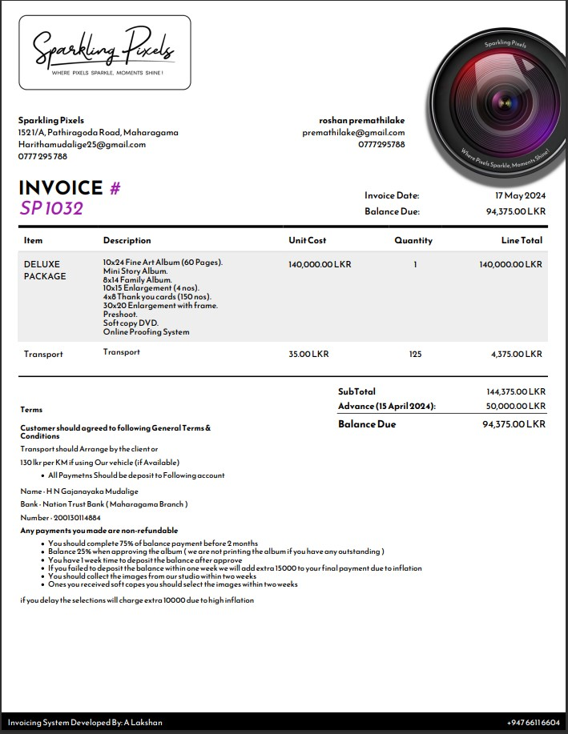
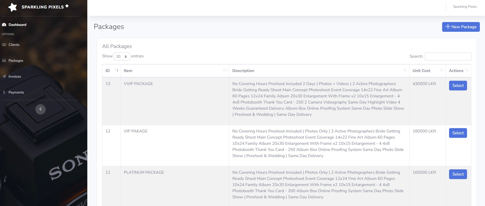
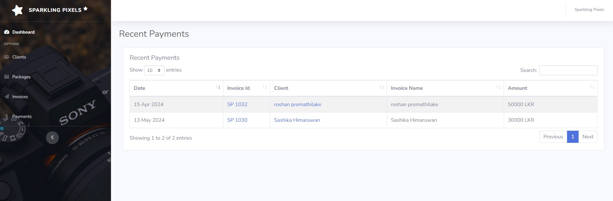

# Invoice System for Sparkling Pixels

This project is a **fully featured Invoice system** developed for Sparkling Pixels Photography Studio. It is built using **HTML, CSS, JavaScript, PHP**, and **SQLite** as a web project. After development, it is converted into a desktop application using the [**PHP DESKTOP**](https://github.com/cztomczak/phpdesktop) library.

## Customer Requirements

- The main requirement is **generating custom-designed modern-looking invoices.**
- **Manage clients.**
- **Manage packages.**
- **Manage invoices.**
- **Track payments.**

## Features of the System

- **Manage Clients:** 
  Users can add, edit, and delete clients. When viewing client details, users can also view all invoices created for a specific client.

- **Manage Packages:** 
  Users can add, edit, and delete packages. When creating an invoice, users can easily add these packages to the invoice.

- **Manage Invoices:** 
  Users can create and manage fully customizable invoices for clients. Add payments to specific invoices, customize terms and conditions for specific invoices, and add special notes to the invoices.

- **Tracking Payments:** 
  Users can track all payments in one place using filters by client, invoice number, and sort by date or invoice numbers.

- **Generate PDF Invoices:** 
  Users can generate custom-designed modern-looking invoices with all the details including terms and conditions.

- **Admin Dashboard:** 
  A comprehensive dashboard including total outstanding, total payments, client count, invoice count, and a **graph view of payments overview for each month**.

- **Customizable Settings:** 
  Users can fully customize studio details including phone number, address, email, and the terms and conditions of the invoices.

- **Backup and Restore:** 
  Users can easily backup the entire system data and restore previously backed up data.

## Technologies Used

- HTML, CSS, JavaScript
- PHP
- SQLite

## Architecture and Code Structure

The project follows the MVC (Model-View-Controller) architecture for clean and reusable code. The codebase is structured for easy maintenance and scalability.

## User Interface

The user interface is designed adhering to UI/UX principles and follows a clean, clear, and minimalistic design.

## Project Screenshots

PDF invoice design (Actual generated invoice)

Dashboard

Manage Clients

Manage Packages

Create Invoice

Tracking Payments

Backup and Restore

## Getting Started

To run this project locally, follow these steps:

1. Clone the repository.
2. Set up a local server environment (e.g., XAMPP, WAMP, or MAMP).
3. Import the project database.
4. Configure the necessary settings in `app/core/config.php`.
5. Run the application on the local server.

## Contributors

Designed and developed by [Anushka Lakshan](https://github.com/Anushka-Lakshan)
